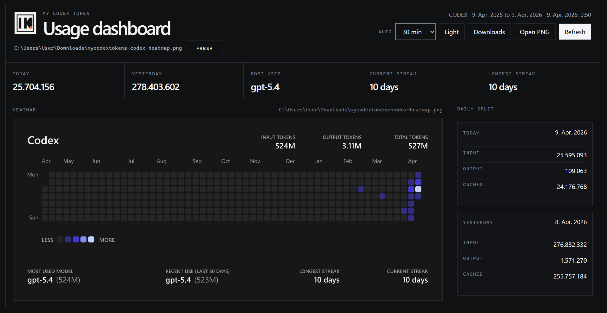

# MyCodexTokens

<p align="center">
  
</p>

<p align="center">
  A clean desktop wrapper around the <code>npx slopmeter@latest --codex</code> workflow that keeps Codex usage visible without living in the terminal.
</p>

<p align="center">
  <a href="https://github.com/JeanMeijer/slopmeter">Powered by slopmeter</a> ·
  <a href="#getting-started">Getting Started</a> ·
  <a href="#usage-notes">Usage</a> ·
  <a href="#credits">Credits</a>
</p>

<p align="center">
  
</p>

## Overview

MyCodexTokens is a lightweight Electron app for people who use Codex heavily and want a cleaner way to check token activity.

It runs `slopmeter` locally, saves the latest export into your Downloads folder, and presents the result in a flat desktop UI with theme-aware heatmaps, quick refresh controls, and a clearer daily split.

## Highlights

- One-click refresh for the latest Codex heatmap
- Light and dark application themes
- Light mode also regenerates a light `slopmeter` image
- Daily split with focused `Today` and `Yesterday` sections
- Current streak and longest streak at a glance
- Local exports saved straight into Downloads

## Requirements

- [Node.js 22+](https://nodejs.org/)
- Codex usage data already available on the machine
- A system that can run Electron, including Windows and macOS

## Getting Started

```bash
npm install
npm start
```

The app will refresh automatically on launch and save two files in your Downloads folder:

- `mycodextokens-codex-heatmap.png`
- `mycodextokens-codex-usage.json`

## Usage Notes

- Use `Refresh` whenever you want a new snapshot immediately.
- Change the theme with the theme button. The next refresh will regenerate the heatmap in the matching color mode.
- Use `Downloads` to jump to the exported files quickly.
- Use `Open PNG` to open the latest rendered heatmap directly.
- Make sure Codex has recent local usage data available before refreshing.

## Packaging

```bash
npm run package:win
npm run package:mac
```

The packaging flow stages a minimal app directory first and increases the Node heap size to reduce Electron Builder memory issues.

## Project Structure

```text
assets/      Icons and README screenshot assets
electron/    Electron main and preload processes
scripts/     Build staging helpers
src/         Renderer logic and styles
index.html   Main application shell
```

## Tips

- Keep Codex open long enough for its local usage data to settle before refreshing.
- If the PNG looks out of date, run another refresh instead of relying on an old export.
- If you switch from dark to light mode, wait for the refresh to finish so the image and UI match.

## Sponsor

This repository includes a GitHub sponsor configuration file for `@Leonxlnx`.

To make the sponsor button work end to end, enable GitHub Sponsors for the account first, complete the payout and profile setup in GitHub, and keep the repository funding file pointed at the same username.

## Credits

- Heatmap generation powered by [slopmeter](https://github.com/JeanMeijer/slopmeter), created by [Jean P.D. Meijer](https://github.com/JeanMeijer)
- Desktop shell powered by [Electron](https://www.electronjs.org/)
