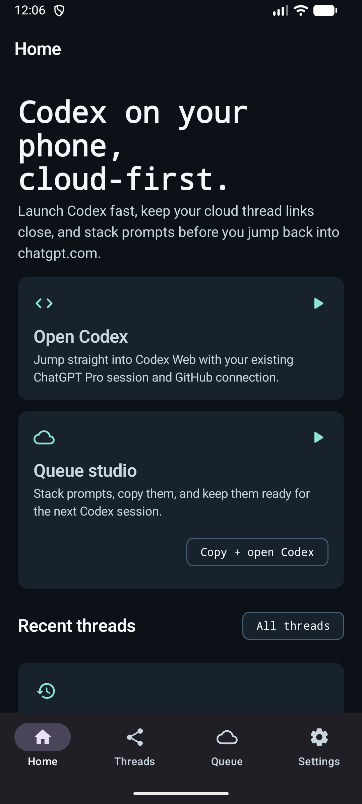
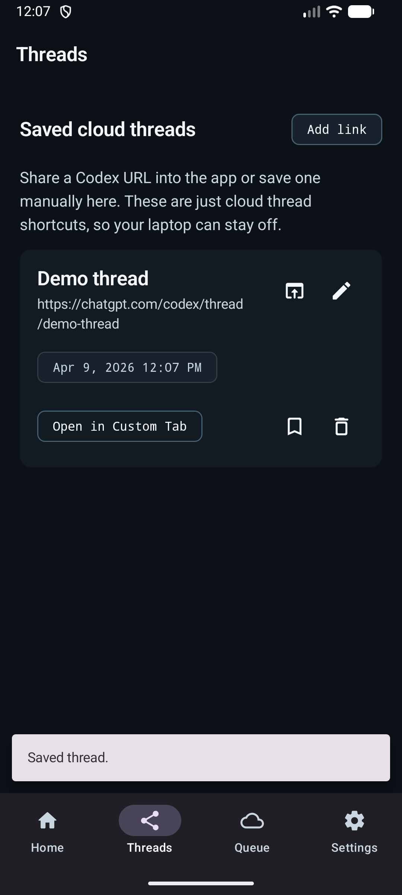
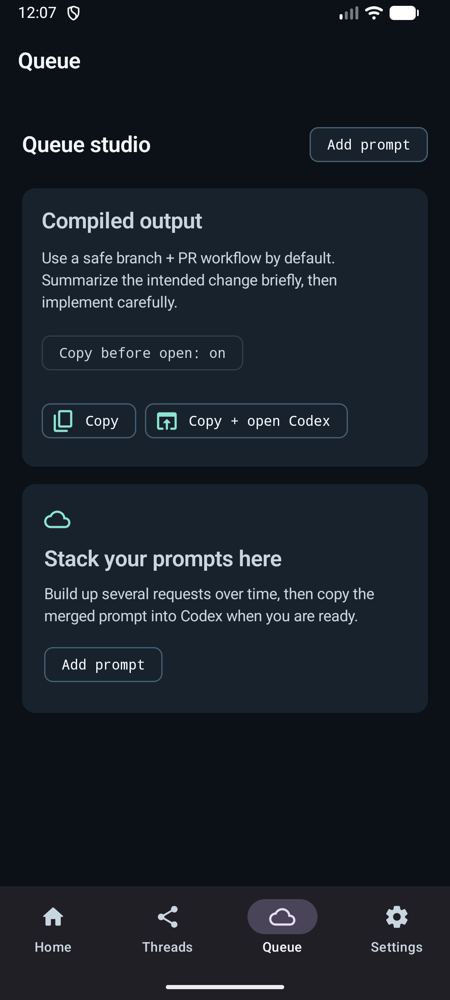

# Codex Companion Android

Personal Android APK for opening Codex Web quickly, saving cloud thread links, pinning repos, and stacking prompts before jumping back into `chatgpt.com/codex`.

## What It Does

- Opens Codex in Chrome Custom Tabs or your external browser
- Reuses your existing ChatGPT Pro browser session
- Saves shared Codex thread links locally on the phone
- Keeps pinned GitHub repo shortcuts and notes
- Builds a prompt queue you can copy and send into Codex

## Screens





## Build

From this folder:

```powershell
.\gradlew.bat assembleDebug
```

The debug APK will land in:

```text
app\build\outputs\apk\debug\
```

## Notes

- This app does not store OpenAI or GitHub credentials.
- Git write actions still happen in Codex Web, not inside the Android app.
- Incoming thread links can be saved by sharing text or a `chatgpt.com` URL into the app.

## Validation

- `.\gradlew.bat testDebugUnitTest assembleDebug`
- Installed and launched on the local `Medium_Phone_API_36.1` Android emulator
- Verified:
  - app launch
  - Home, Threads, Queue, and Settings navigation
  - share-to-app import flow for a Codex cloud link
  - saved thread rendering in the Threads tab
